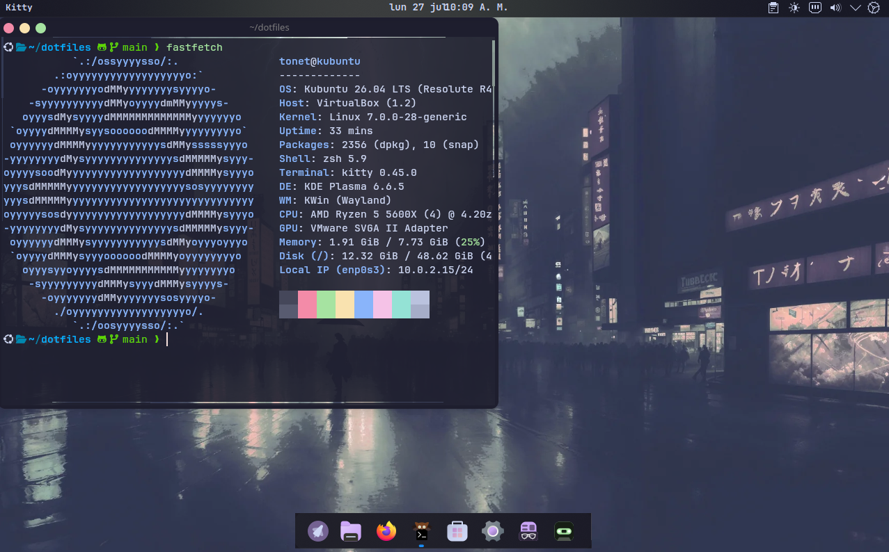

<h1 align="center">🐧 Dotfiles</h1>

<p align="center">
  
</p>

<p align="center">
  Mi entorno de desarrollo para Linux, completamente automatizado y versionado con Git.
</p>

# 🐧 Dotfiles

Mi entorno de desarrollo para Linux, completamente automatizado y versionado con Git.

## 🎯 Objetivo

Este repositorio contiene mi configuración personal para Linux y un instalador que permite reconstruir mi entorno de desarrollo de forma rápida y reproducible.

## ✨ Características

- Instalación automatizada con un solo comando.
- Gestión de configuraciones mediante enlaces simbólicos.
- Copias de seguridad automáticas (`.backup`) antes de sobrescribir archivos.
- Configuración de KDE Plasma y tema Catppuccin Mocha.
- Scripts modulares y fáciles de ampliar.
- Compatible con Kubuntu y adaptable a otras distribuciones Linux.

## 📁 Estructura

```text
dotfiles/
├── assets/
│   └── screenshots/
│       └── escritorio.png
├── config/
│   ├── btop/
│   ├── fastfetch/
│   ├── git/
│   ├── kde/
│   ├── kitty/
│   ├── vscode/
│   └── zsh/
├── scripts/
│   ├── packages.sh
│   ├── symlinks.sh
│   └── utils.sh
├── install.sh
└── README.md
```

## 📂 Organización

| Ruta | Descripción |
|------|-------------|
| `assets/` | Recursos del proyecto (capturas, fondos, fuentes, etc.). |
| `config/` | Archivos de configuración gestionados por el instalador. |
| `scripts/` | Scripts modulares utilizados durante la instalación. |
| `install.sh` | Punto de entrada del instalador. |

## 🚀 Instalación

```bash
git clone https://github.com/Ton3t/dotfiles.git
cd dotfiles
chmod +x install.sh
./install.sh
```

> [!NOTE]
> El instalador crea copias de seguridad (`.backup`) antes de reemplazar cualquier archivo de configuración existente.

## 📦 Software instalado

- Git
- Curl
- Wget
- Eza
- Bat
- FZF
- Zoxide
- Ripgrep
- fd
- btop
- Fastfetch
- jq
- htop
- Tree
- Neovim

## ⚙️ Configuraciones gestionadas

- Zsh
- Kitty
- Git
- btop
- Fastfetch
- KDE Plasma (tema y preferencias)

## 🗺️ Roadmap

### v1.0
- [x] Instalador modular
- [x] Configuración de Zsh
- [x] Configuración de Kitty
- [x] Configuración de Git
- [x] Configuración de btop
- [x] Configuración de Fastfetch
- [x] Configuración de KDE Plasma
- [x] Tema Catppuccin Mocha

### v2.0
- [ ] Node.js
- [ ] Docker
- [ ] VS Code
- [ ] Neovim
- [ ] GitHub CLI

### v3.0
- [ ] Personalización de KDE Plasma
- [ ] Temas Catppuccin
- [ ] Scripts de productividad

## 📄 Licencia

Pendiente de definir.

